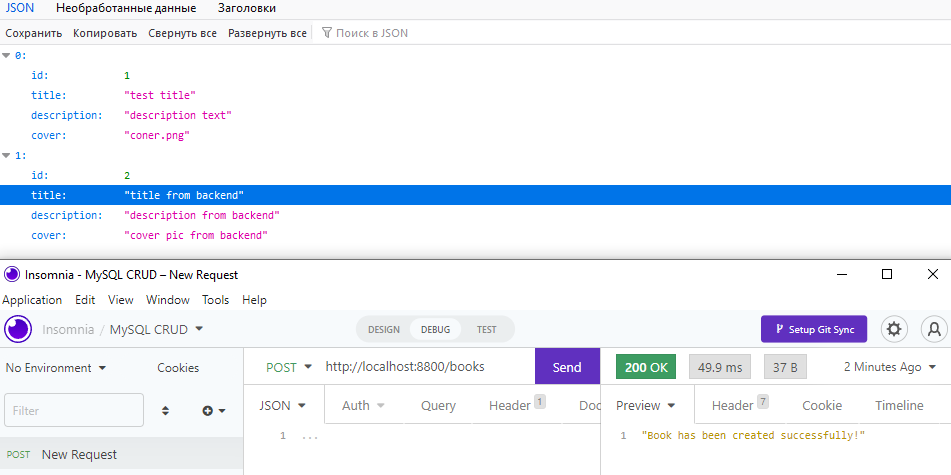
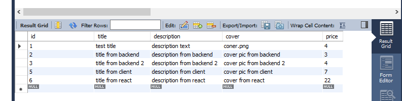
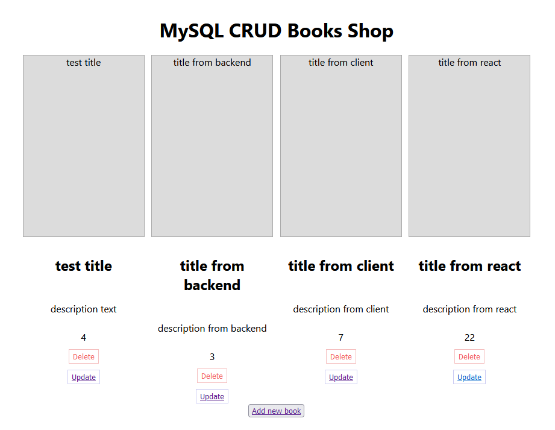
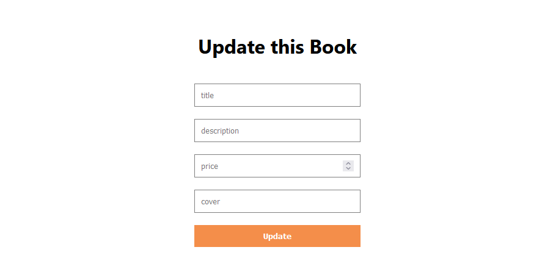
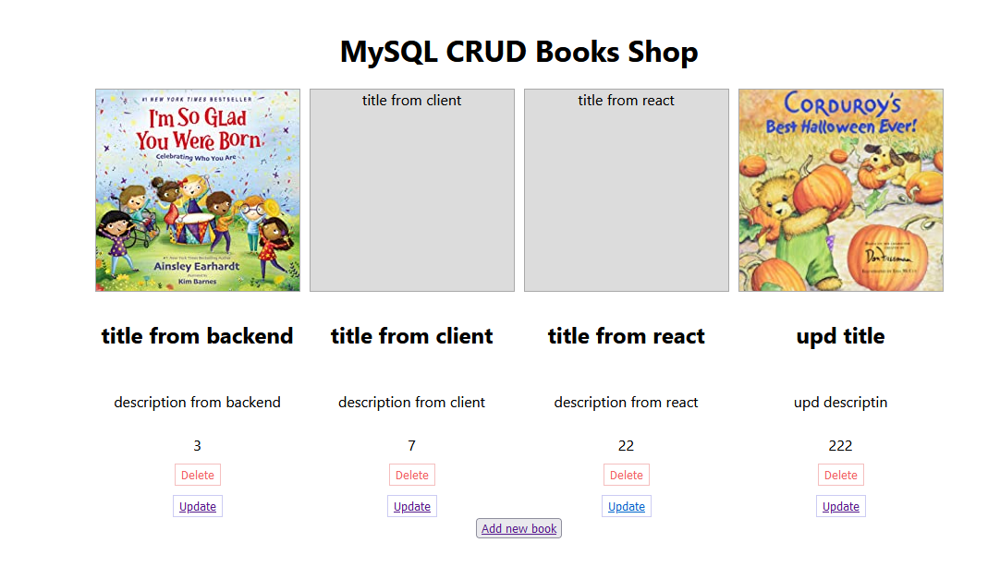

# Basic CRUD with mySQL

```javascript
npm init -y
npm i express mysql nodemon
npm i dotenv

```



## add client test


```javascript
npx create-react-app
// add routes
npm i react-router-dom
// fetch data from backend
npm i axios
// fix CORS «Access-Control-Allow-Origin»)
npm i cors

```

## add clien-side post method



## add update/delete endpoint




